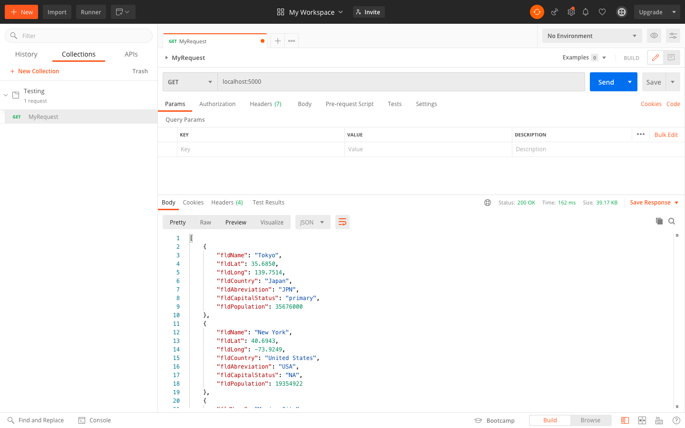
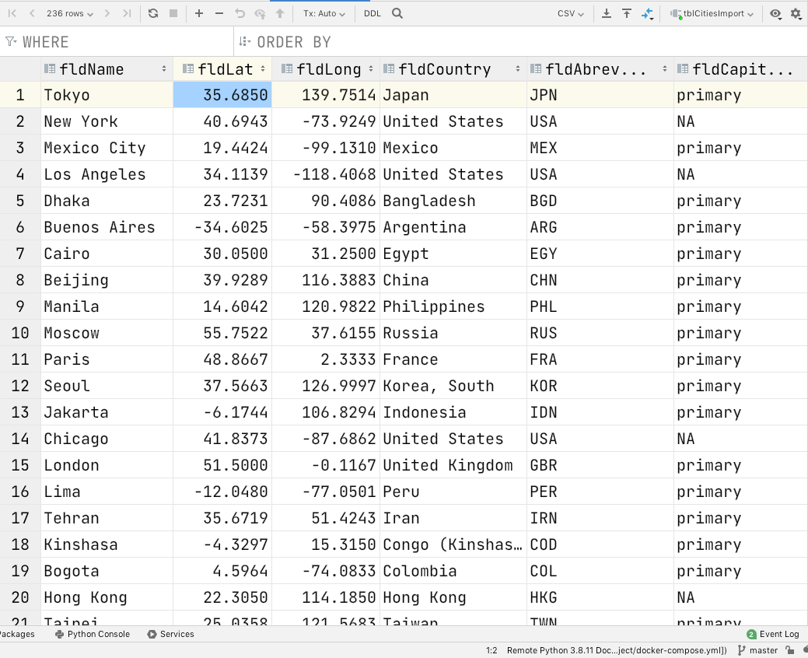

# Project Description
This project is a homework assignment to teach how to get Pycharm setup with Docker, Flask, MySQL, and Postman.

# Postman Screenshot

# SQL Data Screenshot

<h1>Home Page Postman</h1>

</img>

<h1>Home Page HTML/Web Page Preview</h1>

</img>

<h1>New City Page HTML/Web Page Preview</h1>

</img>

<h1>City JSON Postman</h1>

</img>

<h1>City JSON HTML Page Preview</h1>

</img>

<h1>View By Link Postman</h1>

</img>

<h1>View By Link HTML Page Preview</h1>

</img>

<h1>Add City Request Postman</h1>

</img>

<h1>Add City Response Postman</h1>

</img>

<h1> Cities JSON Postman </h1>

</img>

<h1> Cities JSON HTML Preview </h1>

</img>

<h1> City Edit Form Preview </h1>

</img>

<h1> Delete City - NY Postman </h1>

</img>

<h1> Delete City - Tokyo HTML Preview </h1>

</img>

<h1> Edit API Postman Request </h1>

</img>

<h1> Edit API Postman Response </h1>

</img>

<h1> Edit City Result Home Page </h1>

</img>

